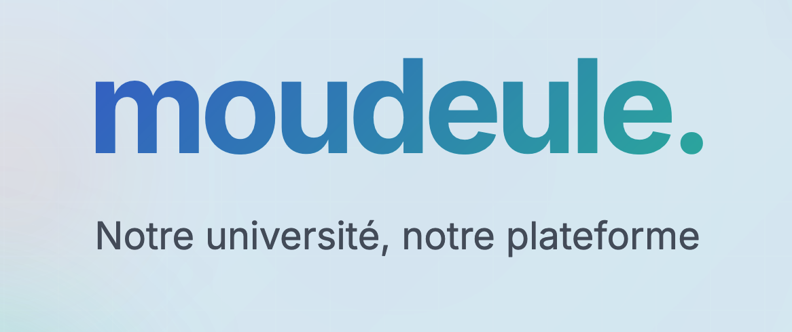

# Moudeule - Plateforme Pédagogique



**Année Académique:** 2024/2025  
**Équipe:** FEKIH HASSEN Yassine, CALMANOVIC-PLESCOFF Auguste, BRIERRE Titouan, KADIC Anais
**Enseignant** M. MARTIN Antoine

## Table des matières

1. [Présentation](#présentation)
2. [Démonstration](#démonstration)
3. [Fonctionnalités](#fonctionnalités)
4. [Architecture technique](#architecture-technique)
5. [Structure du projet](#structure-du-projet)
6. [Installation et configuration](#installation-et-configuration)
7. [Base de données](#base-de-données)
8. [Comptes de démonstration](#comptes-de-démonstration)
9. [Équipe de développement](#équipe-de-développement)

## Présentation

Moudeule est une application web qui simule une plateforme pédagogique pour les établissements d'enseignement supérieur. Ce système de gestion permet d'administrer efficacement les cours, les étudiants, les enseignants, les évaluations et permet les interactions via un forum intégré.

Développée dans le cadre d'un projet universitaire du Master 1 Informatique à l'Université Paris Cité, cette application exploite le framework Laravel pour offrir une expérience fluide, robuste et sécurisée.

## Démonstration

Le site est accessible en ligne sur [AlwaysData](https://www.alwaysdata.com/) :
> **URL :** [https://moudeule.alwaysdata.net/](https://moudeule.alwaysdata.net/)

## Fonctionnalités

- **Gestion multi-rôles** : Administration, enseignants et étudiants
- **Gestion des cours** : Création, organisation et inscription
- **Ressources pédagogiques** : Upload et organisation de documents par sections
- **Planning interactif** : Visualisation et gestion des séances de cours
- **Système d'évaluation** : Gestion des contrôles et notation
- **Forum intégré** : Discussions, commentaires et réactions
- **Annonces** : Publication d'informations importantes

## Architecture technique

Moudeule est développé avec **Laravel**, suivant l'architecture MVC (Model-View-Controller) :

- **Frontend** : Blade templates, CSS, JavaScript
- **Backend** : PHP 8.1+, Laravel
- **Base de données** : SQLite 
- **Authentification** : Système personnalisé avec gestion de rôles

## Structure du projet

### Vue d'ensemble

```
moudeule/
├── app/               # Logique de l'application
├── config/            # Configuration de l'application
├── database/          # Migrations et base de données SQLite
├── public/            # Fichiers publiquement accessibles
├── resources/         # Templates et assets non-compilés
├── routes/            # Définition des routes
├── storage/           # Fichiers générés par l'application
└── tests/             
```

### Détails des principaux répertoires

#### `/app`
```
app/
├── Http/
│   ├── Controllers/   # Contrôleurs de l'application
│   │   ├── AdminController.php
│   │   ├── CourseController.php
│   │   ├── DocumentController.php
│   │   ├── ForumController.php
│   │   └── ...
│   └── Middleware/    # Middleware d'authentification et autorisation
├── Models/            # Modèles de données
│   ├── User.php
│   ├── Cours.php
│   ├── Document.php
│   ├── Controle.php
│   └── ...
└── Providers/         
```

#### `/resources`
```
resources/
├── css/               # Style
├── js/                # Scripts JavaScript
└── views/             # Templates Blade
    ├── admin/         # Interface d'administration
    ├── auth/          # Vues d'authentification
    ├── cours/         # Gestion des cours
    ├── forum/         # Interface du forum
    ├── layouts/       # Templates principaux
    └── components/    # Composants réutilisables
```

#### `/public`
```
public/
├── css/               # Feuilles de style compilées
├── js/                # Scripts JavaScript compilés
├── images/            # Images statiques
└── storage/           # Lien symbolique vers le stockage
    └── documents/     # Documents téléchargés
```

#### `/database`
```
database/
├── db.sqlite          # Base de données SQLite pré-configurée pour vous
├── migrations/        # Migrations de base de données
└── seeders/           
```

## Installation et configuration

### Prérequis
- PHP 8.1 ou supérieur
- Composer
- SQLite ou MySQL
- Extensions PHP : PDO-SQLite/MySQL, fileinfo

### Étapes d'installation

1. **Cloner le dépôt**
   ```bash
   git clone https://github.com/yassinefkh/moudeule2025.git
   cd moudeule2025
   cd projetweb
   ```

2. **Installer les dépendances**
   ```bash
   composer install
   ```

3. **Configuration de l'environnement**
   ```bash
   cp .env.example .env
   php artisan key:generate
   ```

4. **Configuration de la base de données**
   ```
   # Dans le fichier .env
   DB_CONNECTION=sqlite
   DB_HOST=127.0.0.1
   DB_PORT=3306
   DB_DATABASE=/chemin/absolu/vers/database/db.sqlite
   DB_USERNAME=
   DB_PASSWORD=

   ```

5. **Créer le lien de stockage**
   ```bash
   php artisan storage:link
   ```

6. **Lancer le serveur**
   ```bash
   php artisan serve
   ```

L'application sera accessible à l'adresse: http://localhost:8000

> **Note importante**: Une base de données SQLite complète est déjà fournie dans le répertoire `database/` et contient toutes les données nécessaires pour tester l'application.

## Base de données

### Schéma conceptuel

La base de données comprend les entités principales suivantes:

| Entité | Description |
|--------|-------------|
| **users** | Utilisateurs (administrateurs, enseignants, étudiants) |
| **formations** | Programmes d'études |
| **cours** | Matières enseignées |
| **sections** | Organisation des contenus de cours |
| **documents** | Ressources pédagogiques |
| **controles** | Évaluations |
| **notes** | Résultats des évaluations |
| **posts** | Publications du forum |
| **comments** | Commentaires sur les publications |
| **reactions** | Réactions aux contenus du forum |

### Relations principales

- Un utilisateur peut être inscrit à plusieurs cours (étudiant) ou enseigner plusieurs cours (enseignant)
- Un cours appartient à une formation et possède plusieurs sections, documents et contrôles
- Un contrôle contient plusieurs notes attribuées aux étudiants
- Un post possède des commentaires et des réactions

## Comptes de démonstration

| Rôle | Identifiant | Mot de passe |
|------|-------------|--------------|
| Admin | admin | admin |
| Enseignant | mantoine | mantoine |
| Étudiant | yassinefekih | yassinefekih |

## Équipe de développement

- **Yassine FEKIH HASSEN** (M1 VMI)
- **Auguste CALMANOVIC-PLESCOFF** (M1 VMI)
- **Titouan BRIERRE** (M1 VMI)
- **Anais KADIC** (M1 VMI)

---

Projet encadré par **M. Antoine MARTIN**, Enseignant de l'UE Programmation Web.